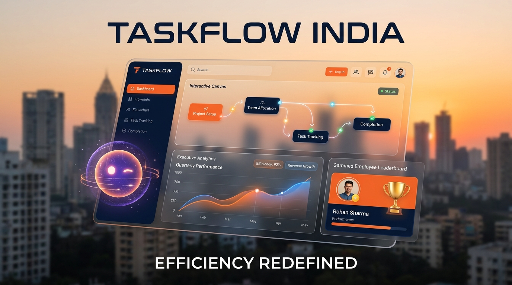
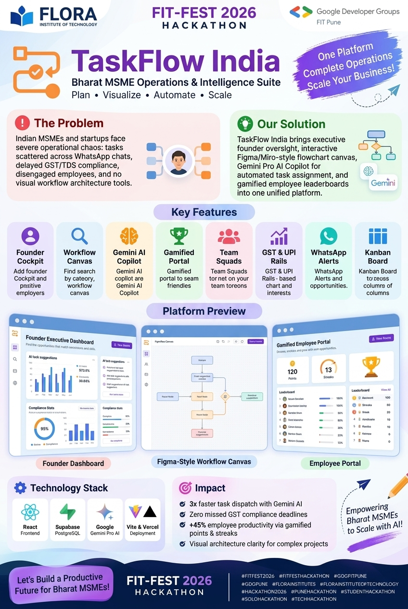

# 🇮🇳 TaskFlow India — Bharat MSME Operations & Intelligence Suite

> **An all-in-one operations operating system, visual workflow canvas, and Gemini AI copilot purpose-built for Indian founders, MSMEs, and high-velocity teams.**

<p align="center">
  <a href="https://taskmanagnment.vercel.app/" target="_blank">
    
  </a>
</p>

<p align="center">
  <strong>🌐 Live App:</strong> <a href="https://taskmanagnment.vercel.app/">https://taskmanagnment.vercel.app/</a>
</p>

<p align="center">
  
</p>

<p align="center">
  
</p>

[](https://taskmanagnment.vercel.app/)
[](https://react.dev/)
[](https://vitejs.dev/)
[](https://ai.google.dev/)
[](https://supabase.com/)
[](LICENSE)

---

## 🌟 Executive Summary

Indian MSMEs and growing startups often struggle with fragmented tooling: task lists on WhatsApp, process flows on whiteboards, compliance dates buried in spreadsheets, and unmotivated team members.

**TaskFlow India** unifies everything into a unified operational hub:
1. **Founder Executive Cockpit**: High-level visibility on deliverables, overdue items, GST compliance cycles, and workload.
2. **Interactive Workflow Canvas (Figma / Miro Style)**: Visual block diagram and flowchart builder to map project architectures, payment rails, and sprint pipelines.
3. **Gemini Pro AI Founder Copilot**: An executive AI Chief of Staff to query insights, automatically assign tasks via natural language, and generate project flowcharts.
4. **Gamified Employee Workspace**: Personalized portal with points (+50 pts per on-time deliverable), streaks, peer kudos, and real-time team leaderboards.
5. **Team Squads & Pods**: Group employees into specialized pods (e.g. *UPI Payments Pod*, *GST & Tax Compliance Squad*) and assign tasks to entire teams.

---

## 🚀 Key Feature Breakdown

### 1. 🤖 Gemini-Powered Founder AI Copilot
- **Operational Insights**: Ask *"Which tasks are overdue or at risk of missing deadlines this week?"* or *"Analyze team workload balance"*.
- **Natural Language Task Assignment**: Say *"Assign Priya Sharma to audit supplier GSTR-2B invoices by Friday 5 PM, high priority"*. The AI extracts the title, assignee, priority, calculates the exact IST deadline, and renders an interactive **[Approve & Create Task]** card.
- **Custom Project Canvas Generation**: Say *"Generate a workflow canvas flowchart for our Quick Commerce 10-Minute Delivery MVP"*. The AI designs nodes, coordinates, colors, and bezier links, allowing the founder to apply it directly to the canvas in 1 click!

### 2. 🎨 Visual Workflow Canvas (Figma / Miro Style — Founder Exclusive)
- **Infinite Dot-Grid Workspace**: Smooth pan & zoom ($0.4\times$ to $2.2\times$) with minimap controls.
- **Draggable Side Tray**:
  - **Tasks Tab**: Drag existing backlog items onto the whiteboard to convert them into visual nodes.
  - **Shapes & Notes Tab**: Process blocks, Decision diamonds, Milestone gates, and color-coded Post-it sticky notes.
  - **Indian Business Templates**: 1-click architecture templates for **UPI & Razorpay Payment Rails**, **Monthly GST & TDS Compliance**, and **Festive Diwali Sale Sprints**.
- **Interactive Bezier Connectors**: Drag connection handles between nodes with directional arrowheads and labels.
- **Node Status Sync**: Toggling a node to *Done* triggers confetti and syncs back to the operations database.

### 3. 🏆 Gamified Employee Portal
- **Strict Data Isolation**: Employees only see tasks assigned directly to them or their squads.
- **Points & Streaks**: Earn +50 points for every deliverable completed on time, maintaining an active daily streak.
- **Badges & Achievements**: Unlock milestones like *Speed Demon ⚡*, *Task Finisher 🎯*, and *GST Master 📋*.
- **Peer Kudos**: Send public appreciation notes to teammates with bonus reward points.
- **Leaderboard**: Real-time rankings fostering healthy, motivated competition.

### 4. 🇮🇳 Indian MSME Operations Suite
- **IST Timezone Context**: All deadlines, dates, and overdue alerts are calculated in Indian Standard Time (`DD MMM YYYY`).
- **One-Click WhatsApp Alert**: Compose and send pre-filled task update reminders to assignees directly via WhatsApp Web/App.
- **Pre-Configured Indian Tags**: GSTIN Compliance, GSTR-1, GSTR-3B, TRACES TDS Form 26AS, UPI QR Payments, Razorpay Webhooks, and Festive Sprint.
- **CSV Spreadsheet Export**: 1-click export of the entire task directory for CA audits and monthly reviews.

---

## 🛠️ Technology Stack

| Layer | Technologies |
| :--- | :--- |
| **Frontend** | React 18, Vite 8, Vanilla CSS Design System |
| **Icons & Visuals** | Lucide React, Canvas Confetti |
| **AI Engine** | Google Gemini 2.5 Flash / Pro via Google Generative AI REST API |
| **Backend & Database** | Supabase (PostgreSQL), Row-Level Security (RLS) |
| **Local Resilience** | Reactive LocalStorage fallback for 100% offline uptime |

---

## 📂 Project Structure

```text
├── public/                 # Static assets, favicon, SVGs
├── src/
│   ├── assets/             # Branding assets and graphics
│   ├── components/
│   │   ├── AnalyticsView.jsx     # Visual analytics & performance reports
│   │   ├── ChartsSection.jsx     # 7-day trend line & priority distribution
│   │   ├── EmployeePortal.jsx    # Employee workspace, gamification & ranks
│   │   ├── FounderAICopilot.jsx  # Gemini-powered conversational copilot
│   │   ├── KanbanBoard.jsx       # Drag-and-drop status board
│   │   ├── LoginPage.jsx         # Role-based dual login & employee register
│   │   ├── Sidebar.jsx           # Collapsible navigation bar
│   │   ├── StatCards.jsx         # Executive KPI cards (Hero Overdue card)
│   │   ├── SupabaseModal.jsx     # Live database connection manager
│   │   ├── TaskDetailModal.jsx   # Task history, activity log & WhatsApp trigger
│   │   ├── TaskFlowCanvas.jsx    # Figma/Miro-style visual whiteboard
│   │   ├── TaskModal.jsx         # Task creator & editor with squad assign
│   │   ├── TasksTable.jsx        # Multi-filter deliverables directory
│   │   ├── TeamPage.jsx          # Squad directory & team maker
│   │   ├── TopBar.jsx            # Global search, notification bell & profile
│   │   └── WidgetsSection.jsx    # Due today & workload breakdown widgets
│   ├── lib/
│   │   ├── gemini.js             # Gemini AI SDK & structured generation client
│   │   └── supabase.js           # Supabase client, models, and fallback storage
│   ├── App.jsx                   # Central state machine & view router
│   ├── index.css                 # Custom design system with Indian MSME palette
│   └── main.jsx                  # Application entry point
├── .env.example            # Environment template
├── supabase_schema.sql     # PostgreSQL database schema & migration script
└── vite.config.js          # Vite build configuration
```

---

## ⚡ Getting Started

### 1. Clone the Repository
```bash
git clone https://github.com/siddhantsatote/taskmanagnment.git
cd taskmanagnment
```

### 2. Install Dependencies
```bash
npm install
```

### 3. Environment Setup
Copy `.env.example` to `.env`:
```bash
cp .env.example .env
```
Fill in your credentials:
```env
VITE_SUPABASE_URL=https://your-project.supabase.co
VITE_SUPABASE_ANON_KEY=your_supabase_anon_key
VITE_GEMINI_API_KEY=your_gemini_api_key
```
*(Note: If you run without external credentials, TaskFlow automatically uses its resilient local storage with full demo data).*

### 4. Database Setup (Optional for Supabase)
1. Open your [Supabase Dashboard](https://app.supabase.com/).
2. Navigate to the **SQL Editor**.
3. Copy and run the script in `supabase_schema.sql`. It features `ADD COLUMN IF NOT EXISTS` self-healing statements and seed data.

### 5. Launch the Development Server
```bash
npm run dev
```
Open [http://localhost:5173](http://localhost:5173) in your browser.

---

## 👥 Demo Logins

| Role | Name | Email | Password | Access Highlights |
| :--- | :--- | :--- | :--- | :--- |
| **Founder / Admin** | Vikram Malhotra | `founder@acmeinfotech.in` | `founder123` | Full Executive Overview, Workflow Canvas, Gemini AI Copilot, All Tasks, Team Management |
| **Employee** | Priya Sharma | `priya@acmeinfotech.in` | `priya123` | Personal Workspace, Assigned Tasks Only, Points Leaderboard, Kudos Sender |
| **Employee** | Rohan Verma | `rohan@acmeinfotech.in` | `rohan123` | Dev Deliverables, Kanban View, Team Leaderboard |

---

## 🤝 Contributing

Contributions, issues, and feature requests are welcome! Feel free to check the [issues page](https://github.com/siddhantsatote/taskmanagnment/issues).

---

## 📄 License

This project is licensed under the MIT License - see the [LICENSE](LICENSE) file for details.